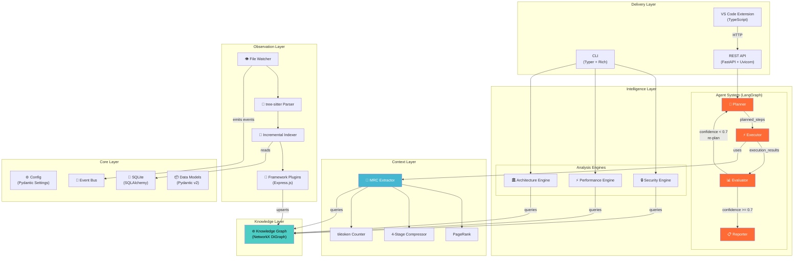
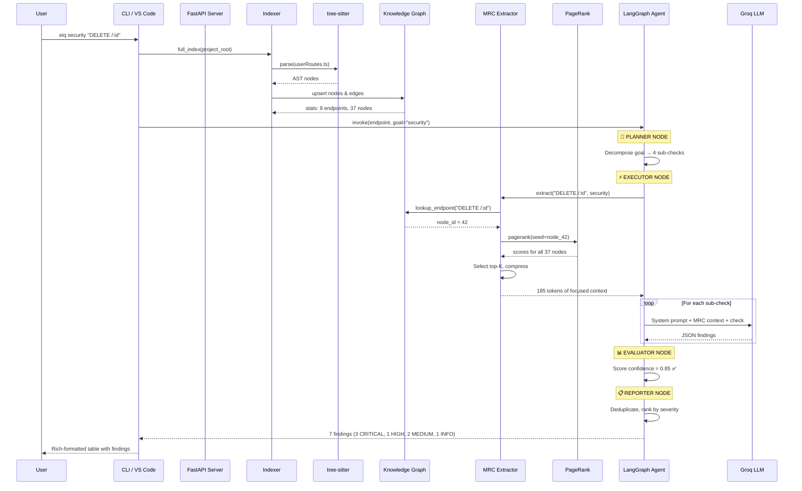
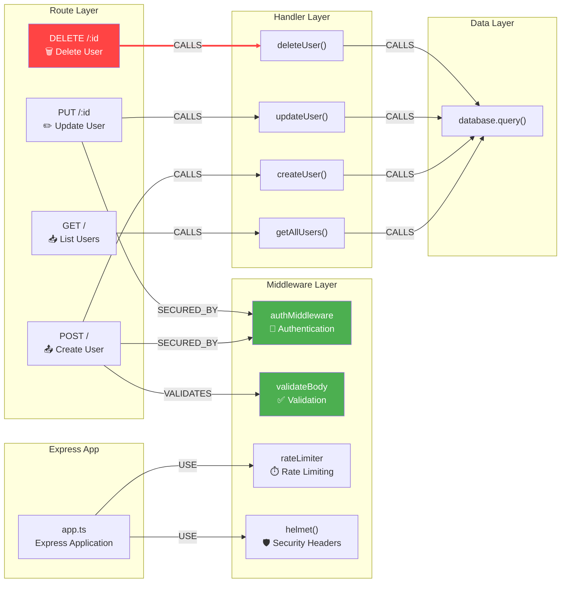
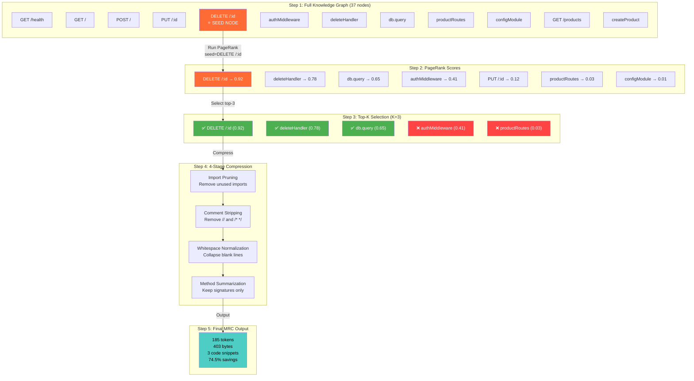
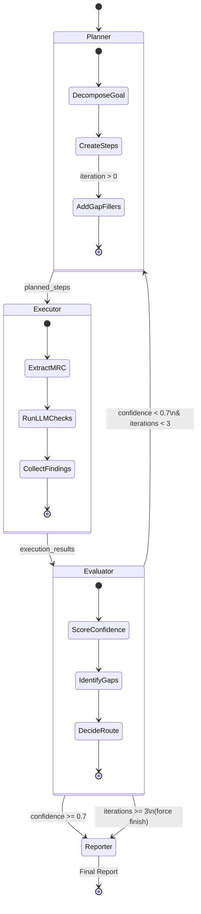

# EndpointIQ — Exhaustive Interview Guide with Architecture Diagrams

---

## 🎯 Section 1: The Elevator Pitch (Memorize This)

### 15-Second Version
> "EndpointIQ is an AI-powered API analysis platform. It builds a knowledge graph of your API, uses PageRank to extract only the relevant code context, and runs a multi-agent LLM loop to detect security vulnerabilities — using 74.5% fewer tokens than sending the full codebase."

### 60-Second Version
> "I built EndpointIQ because I noticed a fundamental problem with how AI code analysis tools work. They dump your entire codebase into an LLM — that's expensive, slow, and the model gets distracted by irrelevant code.
>
> My approach is different. First, I use tree-sitter to parse the AST of every file and build a knowledge graph — a directed graph where nodes are endpoints, middleware, controllers, and services, connected by typed edges like CALLS and SECURED_BY.
>
> When you ask 'analyze DELETE /users/:id for security', I don't send everything. I run Personalized PageRank starting from that endpoint node — this scores every code entity by its structural relevance. I select the top nodes, compress their source through a 4-stage pipeline, and send only ~200 bytes instead of 2,500 bytes.
>
> The analysis itself is a LangGraph multi-agent system. A Planner decomposes the goal into sub-checks. An Executor runs each check against the LLM. An Evaluator scores confidence — if it's below 0.7, the system re-plans and tries again. This loop produces 7 findings compared to 3 from a single-pass static analysis.
>
> The result: 74.5% fewer tokens, 25.5% faster, and deeper findings including IDOR vulnerabilities and injection patterns that static analysis alone can't catch."

---

## 🏗️ Section 2: Architecture Diagrams

### 2.1 — Full System Architecture (High-Level)



**How to explain this diagram:**
> "The system has 6 layers. At the bottom, the Core handles config and storage. The Observation layer watches files and parses them using tree-sitter. The Knowledge layer stores everything as a graph. The Context layer extracts minimal relevant code. The Intelligence layer runs the actual analysis — either through static engines or the multi-agent LLM system. And the Delivery layer exposes it all through CLI, REST API, and VS Code."

---

### 2.2 — Data Flow: End-to-End Analysis



**How to explain this:**
> "When you run an analysis, the system first indexes the project — tree-sitter parses every file and builds the knowledge graph. Then the LangGraph agent kicks in: the Planner breaks the goal into sub-checks, the Executor extracts MRC context using PageRank and sends each check to the LLM, the Evaluator scores the confidence, and the Reporter compiles the final output."

---

### 2.3 — Knowledge Graph Structure



**How to explain this:**
> "Look at DELETE /:id — it has a CALLS edge to its handler, and the handler CALLS the database. But notice: it has NO `SECURED_BY` edge. POST and PUT have one pointing to authMiddleware, but DELETE doesn't. That's how EndpointIQ detects the missing authentication — it's a graph traversal, not a string search."

---

### 2.4 — MRC Algorithm Visualization



**How to explain this:**
> "Starting from the DELETE /:id node, PageRank assigns relevance scores to every node in the graph. The handler and DB call score high because they're directly connected. Product routes score near zero because they're structurally irrelevant. We select the top-K nodes, compress their source code through 4 stages, and end up with 185 tokens — down from 726."

---

### 2.5 — Agent Re-Planning Loop



**How to explain this:**
> "The key innovation is the re-planning loop. If the Evaluator finds that the first pass missed file paths or had incomplete checks, it sends the gaps back to the Planner. The Planner creates additional steps to fill those gaps, and the Executor runs them. This typically bumps confidence from 0.5 to 0.85+ in one re-plan iteration."

---

## 📚 Section 3: Every Technology Explained (Exhaustive)

### 3.1 — Core Technologies

#### Python 3.12
- **What**: The programming language for the entire backend
- **Why 3.12 specifically**: Support for `type` keyword, improved error messages, and performance improvements (10-15% faster startup)
- **Features used**: Type hints everywhere (`list[dict[str, Any]]`), `from __future__ import annotations` for forward references, dataclasses with `@dataclass`, f-strings, walrus operator (`:=`)
- **If asked "why Python?"**: "Python has the richest AI/ML ecosystem — LangChain, LangGraph, tiktoken, tree-sitter bindings all exist in Python. The alternative was TypeScript, but the graph algorithms and AST manipulation libraries are more mature in Python"

#### Pydantic v2
- **What**: Data validation library using Python type hints
- **Core concept**: You define a class with type annotations, and Pydantic:
  - Validates data at runtime (wrong type? raises `ValidationError`)
  - Coerces compatible types (string "42" → int 42)
  - Serializes to dict/JSON (`model.model_dump()`)
- **v2 vs v1**: v2 is written in Rust (pydantic-core), 5-50x faster than v1
- **Where we use it**:
  - `Finding` model: severity, title, description, file_path, recommendation
  - `EndpointIQConfig`: all configuration fields with defaults
  - FastAPI request/response models: `AnalysisRequest`, `AnalysisResponse`
- **Code example from our project**:
  ```python
  class Finding(BaseModel):
      severity: str = "info"  # critical/high/medium/low/info
      title: str = ""
      description: str = ""
      file_path: str = ""
      line_number: int | None = None
      recommendation: str = ""
  ```
- **Interview answer**: "Pydantic v2 gave me three things: runtime validation so malformed LLM output doesn't crash the system, automatic JSON serialization for the API layer, and IDE autocomplete for every data structure. The Rust-core v2 engine handles validation at near-zero overhead"

#### Pydantic Settings
- **What**: Extension of Pydantic for configuration management
- **How it works**: Loads values from multiple sources in priority order:
  1. Environment variables (e.g., `EIQ_GROQ_API_KEY=gsk_...`)
  2. `.env` file
  3. `.endpointiq.toml` file
  4. Default values in the class
- **The `env_prefix`**: All env vars are prefixed with `EIQ_` to avoid collisions with other tools
- **Interview answer**: "This follows the 12-factor app methodology — configuration is environment-driven, secrets never live in code, and defaults are sensible"

#### SQLAlchemy + SQLite
- **SQLAlchemy**: Python's most popular ORM. Maps Python classes to database tables
- **SQLite**: A file-based database (no server needed). The entire DB is one file: `.endpointiq/data.db`
- **What we store**: File metadata (path, hash, last modified, file type), analysis history
- **Why not PostgreSQL**: EndpointIQ runs as a CLI tool on developer machines. SQLite requires zero setup — no `docker run postgres`, no connection strings
- **Why not just JSON files**: SQLAlchemy gives us proper querying, indexing, and ACID transactions. When we check "has this file changed since last index?", it's a simple SQL query
- **Interview answer**: "SQLite was the pragmatic choice for a developer tool — zero setup, ACID-compliant, and SQLAlchemy gives us the abstraction to swap to PostgreSQL for a multi-user SaaS deployment"

#### Event Bus (Observer Pattern)
- **What**: A publish-subscribe messaging system within the application
- **Pattern**: Observer/PubSub — publishers emit events, subscribers react to them
- **Events in our system**:
  - `file_changed(path)` — emitted by the File Watcher
  - `file_deleted(path)` — emitted by the File Watcher
  - `index_complete(stats)` — emitted by the Indexer
  - `analysis_started(endpoint)` — emitted by the CLI
- **Why**: Without an event bus, the File Watcher would need to import the Indexer, which would need to import the Graph — tight coupling. With events, each component only knows about the event names, not other components
- **Interview answer**: "The event bus implements the Observer pattern — it decouples the observation pipeline from the analysis layer. Components communicate through events, not direct function calls, which makes the system extensible and testable"

---

### 3.2 — Observation Technologies

#### tree-sitter
- **What**: A parser generator tool and incremental parsing library. Created by Max Brunsfeld at GitHub for use in Atom editor (now used in VS Code, Neovim, etc.)
- **How it's different from regex**:
  ```
  Regex approach (fragile):
    /router\.(get|post|put|delete)\s*\(\s*['"]([^'"]+)['"]/

  Problem: Breaks on multi-line, comments, template literals, nested parens
  ```
  ```
  tree-sitter approach (robust):
    Query the AST for CallExpression where:
      - object is MemberExpression (router.get)
      - first argument is StringLiteral
    Works regardless of formatting, comments, or whitespace
  ```
- **Incremental parsing**: When a file changes, tree-sitter only re-parses the changed region. For a 10,000-line file where you edit line 500, it re-parses ~50 lines instead of 10,000
- **Language grammars**: tree-sitter uses `.so` grammar files (compiled C). We load `tree-sitter-javascript` and `tree-sitter-typescript` for Express.js projects
- **How we query the AST**:
  ```python
  # Find all router.METHOD() calls
  for node in ast.root_node.children:
      if node.type == "expression_statement":
          call = node.children[0]
          if call.type == "call_expression":
              # Extract method, path, middleware, handler
  ```
- **Interview deep-dive**: "tree-sitter produces a concrete syntax tree (CST), not an abstract one. The difference is that a CST preserves all tokens including whitespace and comments, while an AST abstracts them away. We use tree-sitter's CST but query it like an AST, which gives us both precision and the ability to map back to exact line numbers"

#### AST (Abstract Syntax Tree) — Full Explanation
- **Concept**: Every programming language has a grammar — rules that define valid syntax. An AST is the result of parsing source code according to that grammar
- **Analogy**: Like a family tree for your code. The root is the "Program" node, children are statements, grandchildren are expressions, and leaves are literals/identifiers
- **Real example from our project**:
  ```javascript
  // Source code:
  router.delete('/:id', async (req, res) => {
      const user = await User.findByIdAndDelete(req.params.id);
      res.json({ message: 'Deleted' });
  });
  ```
  ```
  // AST (simplified):
  ExpressionStatement
  └── CallExpression
      ├── MemberExpression
      │   ├── Identifier: "router"
      │   └── Property: "delete"
      └── Arguments
          ├── StringLiteral: "/:id"
          └── ArrowFunction
              ├── Parameters: ["req", "res"]
              └── BlockStatement
                  ├── VariableDeclaration
                  │   └── AwaitExpression
                  │       └── CallExpression: "User.findByIdAndDelete"
                  └── ExpressionStatement
                      └── CallExpression: "res.json"
  ```
- **Why we need it**: From this AST, we extract:
  - Endpoint: `DELETE /:id`
  - Handler: the arrow function
  - DB call: `User.findByIdAndDelete` (no parameterized query!)
  - No middleware in the arguments → missing auth!
- **Interview answer**: "The AST gives us structural understanding of code. Instead of regex-matching `router.delete(`, which breaks on multi-line code or string literals, we traverse the AST and precisely identify call expressions, their arguments, and their handlers. This is the same approach that compilers, linters, and code formatters use"

#### Framework Plugin Architecture
- **Design Pattern**: Strategy Pattern — define an interface, implement it differently for each framework
- **Interface**:
  ```python
  class FrameworkPlugin(Protocol):
      def detect(self, project_root: Path) -> bool: ...
      def extract_endpoints(self, ast: Tree, file_path: Path) -> list[Endpoint]: ...
      def extract_middleware(self, ast: Tree) -> list[Middleware]: ...
  ```
- **Express Plugin** checks:
  1. `package.json` contains `"express"` in dependencies? → Activate
  2. Scan AST for `app.get()`, `router.post()`, `app.use()` patterns
  3. Extract route path (1st arg), middleware (middle args), handler (last arg)
- **Why pluggable**: Adding FastAPI support = one new file implementing the same interface. No changes to indexer, graph, or analysis engines
- **Interview answer**: "The plugin architecture follows the Open/Closed Principle — open for extension (add new framework plugins), closed for modification (existing code doesn't change). Each plugin implements a Protocol (Python's structural typing) so there's no base class coupling"

#### Incremental Indexer
- **What it does**: Keeps the knowledge graph in sync with file changes
- **Algorithm**:
  ```
  for each file in project:
      hash = SHA-256(file_content)
      if hash == stored_hash:
          skip (unchanged)
      elif file is new:
          parse AST → extract entities → upsert into graph
      elif file changed:
          remove old nodes for this file
          parse AST → extract entities → upsert into graph
      elif file deleted:
          remove all nodes for this file from graph
  ```
- **Why content hashing**: File modification timestamps can be unreliable (git checkout, rsync). Content hashing (SHA-256) is the ground truth — if the bytes haven't changed, the file hasn't changed
- **Interview answer**: "The indexer uses content-addressable storage — similar to how Git tracks changes. SHA-256 hashing gives us O(1) change detection per file, and incremental updates mean re-indexing a 500-file project after one file change takes milliseconds, not seconds"

---

### 3.3 — Knowledge Graph Technologies

#### NetworkX
- **What**: Python's most popular graph theory library. 5000+ GitHub stars, maintained by NumFocus
- **Data structure**: `nx.DiGraph()` — a directed graph stored as adjacency lists in Python dicts. Nodes and edges can have arbitrary attributes
- **Why directed**: The relationships are directional. `POST /users` → CALLS → `createUser()` is not the same as `createUser()` → CALLS → `POST /users`
- **Algorithms we use**:
  - `nx.pagerank()` — Personalized PageRank for MRC extraction
  - `nx.simple_cycles()` — Detect circular dependencies
  - `nx.descendants()` — Find all nodes reachable from an endpoint
  - `nx.degree()` — Measure coupling (high degree = high coupling)
- **Performance**: In-memory, O(V+E) for most operations. A 500-file project might have ~200 nodes and ~400 edges — trivial for NetworkX
- **Why not Neo4j**: Neo4j requires a running database server. EndpointIQ is a CLI tool — it should work with `pip install` and nothing else. The config has `graph_backend` ready for Neo4j if we scale to multi-user
- **Interview answer**: "NetworkX runs in-process with zero infrastructure. For a developer tool, this is critical — I don't want users to run `docker compose up` just to lint their API. The graph lives in memory during analysis and serializes to JSON for persistence"

#### Directed Acyclic Graph (DAG)
- **What**: A directed graph with no cycles (technically, our graph CAN have cycles — that's a finding!)
- **Why it matters**: A healthy API architecture should be a DAG: Controllers → Services → Repositories. If we find a cycle (Service A → Service B → Service A), that's a circular dependency — an architectural smell
- **Detection**: `list(nx.simple_cycles(graph))` — if this returns any cycles, we flag them

#### Node Types in Our Graph
| Type | What It Represents | Example |
|---|---|---|
| `endpoint` | An HTTP route | `DELETE /:id` |
| `middleware` | A function that processes requests before the handler | `authMiddleware` |
| `controller` | A class/module that handles business logic for routes | `UserController` |
| `service` | Business logic separated from HTTP concerns | `UserService` |
| `repository` | Data access layer | `UserRepository` |
| `utility` | Helper functions | `hashPassword()` |
| `model` | Data model/schema | `UserModel` |

#### Edge Types in Our Graph
| Type | Meaning | Security Implication |
|---|---|---|
| `CALLS` | A invokes B | Traces execution flow |
| `SECURED_BY` | Endpoint is protected by middleware | Missing edge = missing auth! |
| `DEPENDS_ON` | Module imports another | Circular = architectural issue |
| `VALIDATES` | Middleware validates input for endpoint | Missing = injection risk |

---

### 3.4 — Context Engine Technologies

#### Personalized PageRank — Full Deep-Dive
- **Original PageRank**: Created by Larry Page (Google co-founder) in 1998. The algorithm that made Google work. It scores web pages by importance based on the link structure of the web
- **How regular PageRank works**:
  ```
  1. Every node starts with equal score (1/N)
  2. Each node distributes its score equally to nodes it links to
  3. Repeat for ~20 iterations until scores converge
  4. Nodes linked to by many important nodes get high scores
  ```
- **Personalized PageRank difference**: Instead of starting with equal scores, we start with ALL the score on ONE seed node. The "random walker" starts from our target endpoint and explores outward
- **Why this works for code**: If I set `DELETE /:id` as the seed:
  - The handler function is 1 hop away → high score
  - The DB call is 2 hops away → moderate score
  - The auth middleware is connected but to OTHER endpoints → lower score
  - Product routes are completely disconnected → near-zero score
- **Mathematical formula**: `PR(v) = (1-d) * personalization(v) + d * Σ[PR(u) / out_degree(u)]` where d = damping factor (0.85 default)
- **Damping factor**: Probability of the random walker following edges vs teleporting back to the seed. 0.85 means 85% follow edges, 15% jump back to seed
- **Our code**:
  ```python
  scores = nx.pagerank(
      graph,
      personalization={target_node: 1.0},
      alpha=0.85  # damping factor
  )
  # scores is a dict: {node_id: relevance_score}
  ```
- **Interview answer**: "Personalized PageRank captures transitive relevance — not just direct neighbors, but the entire structural neighborhood of an endpoint. A middleware shared by 10 endpoints gets a lower score than a handler used by only this endpoint, because its score is diluted across 10 paths. This is exactly what we want — focused context"

#### 4-Stage Compression Pipeline — Detailed
Each stage has a specific purpose and handles a specific type of redundancy:

**Stage 1: Import Pruning**
```javascript
// Before:
import { Router } from 'express';
import { User } from '../models/User';
import { logger } from '../utils/logger';
import { cache } from '../utils/cache';

// After (only User is used in our selected context):
import { User } from '../models/User';
```
Why: Imports reference modules we're not sending. The LLM doesn't need to know about `cache` if we're only analyzing the delete handler.

**Stage 2: Comment Stripping**
```javascript
// Before:
// DELETE user - TODO: add authentication!
// This is a known vulnerability, see JIRA-1234
router.delete('/:id', async (req, res) => {

// After:
router.delete('/:id', async (req, res) => {
```
Why: Comments are for humans. The LLM should analyze the code's behavior, not the developer's notes. This also prevents misleading comments from biasing the analysis.

**Stage 3: Whitespace Normalization**
```javascript
// Before:
router.delete('/:id', async (req, res) => {


    const user = await User.findByIdAndDelete(req.params.id);


    res.json({ message: 'Deleted' });

});

// After:
router.delete('/:id', async (req, res) => {
    const user = await User.findByIdAndDelete(req.params.id);
    res.json({ message: 'Deleted' });
});
```
Why: Multiple blank lines waste tokens. Each blank line is a `\n` token.

**Stage 4: Method Summarization** (for large classes)
```python
# Before (500-line class):
class UserService:
    def create_user(self, name: str, email: str) -> User:
        # ... 50 lines of validation, hashing, DB calls
    def delete_user(self, user_id: int) -> bool:
        # ... 30 lines of authorization checks, cascading deletes
    def update_user(self, user_id: int, data: dict) -> User:
        # ... 40 lines

# After (summarized):
class UserService:
    def create_user(self, name: str, email: str) -> User: ...
    def delete_user(self, user_id: int) -> bool: ...
    def update_user(self, user_id: int, data: dict) -> User: ...
```
Why: For context, the LLM only needs to know what methods exist and their signatures. The full implementation would blow the token budget.

#### tiktoken
- **What**: OpenAI's fast BPE (Byte Pair Encoding) tokenizer library
- **How tokenization works**:
  ```
  Text: "router.delete"
  Tokens: ["router", ".", "delete"]  → 3 tokens

  Text: "findByIdAndDelete"
  Tokens: ["find", "By", "Id", "And", "Delete"]  → 5 tokens
  ```
- **Why we need it**: LLMs don't process characters — they process tokens. To enforce our 4,000-token budget, we must count tokens BEFORE sending to the LLM
- **Encoding**: `cl100k_base` — used by GPT-4, GPT-3.5, and most modern models. Roughly 1 token ≈ 4 characters in English, 1 token ≈ 3 characters in code
- **Our usage**:
  ```python
  import tiktoken
  enc = tiktoken.get_encoding("cl100k_base")
  tokens = enc.encode(context)
  print(f"Context uses {len(tokens)} tokens")  # 185
  ```
- **Interview answer**: "tiktoken lets me measure exactly how many tokens a code snippet will consume before I send it to the LLM. This is critical for the token budget — I can guarantee the MRC output stays within 4,000 tokens regardless of project size"

---

### 3.5 — Agent Technologies

#### LangGraph — Full Explanation
- **What**: A library by LangChain Inc. for building stateful, multi-step AI agent workflows
- **Core concept**: You define a **StateGraph** — a directed graph where:
  - Each **node** is a Python function that reads/writes to shared state
  - Each **edge** is a transition between nodes
  - **Conditional edges** branch based on state values
- **How it's different from LangChain**:
  - LangChain: Linear chains (prompt → LLM → output → tool → LLM → output)
  - LangGraph: Arbitrary graphs with loops, conditions, and parallel branches
- **Our StateGraph**:
  ```python
  graph = StateGraph(AgentState)
  graph.add_node("planner", planner_node)
  graph.add_node("executor", executor_node)
  graph.add_node("evaluator", evaluator_node)
  graph.add_node("reporter", reporter_node)

  graph.add_edge(START, "planner")
  graph.add_edge("planner", "executor")
  graph.add_edge("executor", "evaluator")
  graph.add_conditional_edges(
      "evaluator",
      route_after_eval,  # function that checks confidence
      {"planner": "planner", "reporter": "reporter"}
  )
  graph.add_edge("reporter", END)
  ```
- **State management**: The `AgentState` TypedDict is shared across all nodes. Each node can read any field and write to any field
- **Interview answer**: "LangGraph gives me a DAG execution engine with built-in state management and checkpointing. The key advantage over a simple loop is the conditional routing — the Evaluator dynamically decides whether to re-plan or finalize, which enables self-correcting behavior"

#### TypedDict (Python)
- **What**: A Python typing construct that defines a dictionary with specific keys and types
- **Why not a regular dict?**: TypedDict gives us IDE autocomplete and type checking. `state["confidence"]` is known to be a `float`, not `Any`
- **Our state**:
  ```python
  class AgentState(TypedDict):
      endpoint_name: str
      goal_type: str        # "security" | "performance" | "architecture"
      findings: list
      plan: dict
      planned_steps: list
      execution_results: list
      confidence: float     # 0.0 to 1.0
      iteration: int        # 0, 1, 2, 3
      max_iterations: int   # default 3
      token_budget: int     # default 4000
      token_usage: dict     # prompt_tokens, completion_tokens
      report: dict
      gaps: list            # identified by Evaluator
  ```

#### Groq Cloud
- **What**: An AI inference provider that uses custom LPU (Language Processing Unit) chips instead of GPUs
- **Why it's fast**: LPUs are ASICs (Application-Specific Integrated Circuits) designed specifically for transformer inference. No GPU memory bottleneck
- **Speed**: ~500 tokens/sec on Groq vs ~100 tokens/sec on GPU-based providers
- **Why speed matters for us**: The Executor makes 3-4 sequential LLM calls. At 100 tokens/sec, that's 30-40 seconds. At 500 tokens/sec, it's 6-8 seconds
- **Model we use**: `qwen/qwen3.6-27b` — Alibaba's Qwen 3.6 with 27 billion parameters. Strong at code understanding and structured JSON output
- **Free tier**: Generous rate limits for development and testing
- **Interview answer**: "Groq's LPU architecture is purpose-built for sequential token generation — the bottleneck in autoregressive transformers. For our multi-agent loop with 3-4 sequential calls, the ~5x inference speedup directly translates to better user experience"

#### Prompt Engineering
- **Our approach**: Each agent has a specialized system prompt:
  ```
  PLANNER_PROMPT:
  "You are a security analysis planner. Given an API endpoint and
   analysis goal, decompose it into specific sub-checks. Return a
   JSON array of steps, each with 'check' and 'description'."

  EXECUTOR_PROMPT:
  "You are a code security auditor. Analyze the code context for
   {check_type}. Return a JSON array of findings with: severity
   (critical/high/medium/low/info), title, description, file_path,
   recommendation."
  ```
- **Key techniques**:
  1. **Role assignment**: "You are a security auditor" — focuses the model
  2. **Structured output**: "Return JSON with these fields" — makes parsing reliable
  3. **Context truncation**: Code context is capped at 3,000 chars to prevent token overflow
  4. **Temperature 0.0**: Deterministic output — same input = same findings

#### MemorySaver (Checkpointing)
- **What**: LangGraph's built-in state persistence mechanism
- **How**: After each node executes, the entire state is serialized and saved
- **Thread ID**: Each analysis run gets a unique thread ID. This allows concurrent analyses without state collision
- **Why it matters**: If the Executor crashes on the 3rd LLM call, we can resume from the checkpoint instead of starting over
- **Production upgrade**: In production, swap `MemorySaver` (in-memory dict) for `SqliteSaver` or `PostgresSaver` for durable persistence

---

### 3.6 — Delivery Technologies

#### Typer
- **What**: A Python CLI framework by the creator of FastAPI (Sebastián Ramírez). Built on Click
- **How it works**: You write functions with type-annotated arguments, and Typer auto-generates the CLI:
  ```python
  @app.command()
  def security(
      endpoint: str,
      project_dir: Path = Path("."),
      format: str = "table",
  ):
      """Run security analysis on an endpoint."""
      ...
  ```
  This auto-generates: `eiq security "DELETE /:id" --project-dir ./demo --format json`
- **Why not argparse**: Typer gives us subcommands, auto-help, type validation, and Rich integration with zero boilerplate

#### Rich
- **What**: A Python library for rich text and beautiful formatting in the terminal
- **What we use**: Tables (findings), Panels (bordered analysis reports), Trees (dependency graphs), syntax highlighting (code snippets)
- **Why**: First impressions matter. A beautifully formatted CLI output signals quality to users and interviewers

#### FastAPI
- **What**: A modern Python web framework for building APIs. Created by Sebastián Ramírez
- **Built on**: Starlette (async HTTP) + Pydantic (validation) + Uvicorn (ASGI server)
- **Key features we use**:
  - Automatic OpenAPI docs at `/docs`
  - Request/response validation via Pydantic models
  - Async endpoints (`async def run_analysis`)
  - Dependency injection (for config, DB sessions)
- **Our endpoints**:
  | Method | Path | Purpose |
  |---|---|---|
  | `GET` | `/api/health` | Health check + version |
  | `POST` | `/api/projects` | Register & index a project |
  | `GET` | `/api/endpoints` | List discovered endpoints |
  | `POST` | `/api/analysis` | Run analysis (invokes LangGraph agent) |
  | `GET` | `/api/graph/{ep}` | Endpoint subgraph as JSON |
- **Interview answer**: "FastAPI was the natural choice because our data models are already Pydantic. The API layer inherits validation for free — if someone sends `goal_type: 'invalid'`, FastAPI returns a 422 with a clear error before our code even runs"

#### ASGI vs WSGI
- **WSGI**: Synchronous. One request blocks the process until it completes. Flask uses WSGI
- **ASGI**: Asynchronous. Multiple requests can be in-flight simultaneously. FastAPI uses ASGI
- **Why ASGI matters for us**: Our analysis endpoint calls the Groq API (5-10 seconds). With WSGI, the server would be blocked. With ASGI, other requests (health checks, endpoint listing) can be served while the analysis runs
- **Uvicorn**: The ASGI server that runs our FastAPI app. Production alternative: Gunicorn with Uvicorn workers

#### VS Code Extension (TypeScript)
- **Architecture**: Thin client — all business logic is in Python. The extension is just a UI
- **Components**:
  - **TreeDataProvider**: Populates the sidebar with endpoint names
  - **WebviewPanel**: Renders HTML reports with findings
  - **StatusBarItem**: Shows "EndpointIQ: Connected" with endpoint count
- **Communication**: HTTP requests to `http://localhost:8421/api/*`
- **Why thin client**: If we put analysis logic in TypeScript, we'd have to maintain two codebases. Thin client means one source of truth (Python), multiple UIs

---

### 3.7 — Quality & DevOps Technologies

#### pytest (93 Tests)
- **What we test**:
  - Day 1 tests: Config loading, DB schema, event bus, data models
  - Day 2 tests: File watcher, AST parser, Express plugin, indexer
  - Day 3 tests: MRC extractor, PageRank, compression pipeline
  - Day 4 tests: Agent graph, planner, executor, evaluator, reporter
  - Day 5 tests: Security engine, performance engine, architecture engine
  - Day 6 tests: CLI commands, FastAPI endpoints, integration tests
- **Test types**: Unit tests (isolated functions), integration tests (full pipeline)

#### mypy
- **What**: Python's static type checker. Catches type errors without running the code
- **Our config**: Strict mode across all 37 source modules. Zero errors
- **What it catches**: `graph.lookup_endpoint(123)` when it expects `str` → error at lint time, not runtime

#### ruff
- **What**: A Python linter and formatter written in Rust. 10-100x faster than pylint/flake8
- **What it checks**: Unused imports, f-strings without placeholders, import ordering, dead code, style violations
- **Why ruff over pylint**: Speed. Ruff checks our entire codebase in <100ms. Pylint takes seconds

#### GitHub Actions CI/CD
- **Pipeline**: On every push to `main`:
  1. `uv sync` — install dependencies
  2. `ruff check .` — lint
  3. `mypy src/` — type check
  4. `pytest` — run all 93 tests
- **Why**: Catches regressions automatically. Every commit is verified

#### uv
- **What**: A Python package manager written in Rust by Astral (same team as ruff)
- **Why not pip/poetry**: uv is 10-100x faster. `uv sync` takes 1-2 seconds vs 30+ seconds for pip
- **Lockfile**: `uv.lock` ensures reproducible builds — exact same versions on every machine

---

## 📊 Section 4: Numbers You Must Know

| Metric | Value | What It Means |
|---|---|---|
| **Prompt token savings** | 74.5% | 726 → 185 tokens (on 5-file demo project) |
| **Projected savings (500 files)** | 95-99% | MRC extracts same 2-3 files regardless of project size |
| **Context compression** | 84% | 2,531 → 403 bytes |
| **Latency improvement** | 25.5% | 9,755ms → 7,270ms |
| **Cost savings per request** | 9.2% | $0.001334 → $0.001211 |
| **Tests** | 93 | All passing, zero failures |
| **Type-checked modules** | 37 | mypy strict mode, zero errors |
| **Graph nodes (demo)** | 37 | For a 5-file Express project |
| **Endpoints detected** | 6-9 | Auto-discovered via AST |
| **Agent max iterations** | 3 | Re-plan loop limit |
| **Confidence threshold** | 0.7 | Below this → re-plan |
| **LLM speed (Groq)** | ~500 tok/s | vs ~100 tok/s on GPU |
| **Model parameters** | 27B | Qwen 3.6 27B |

---

## 🛡️ Section 5: Handling Tough Questions

### "What's the hardest bug you encountered?"
> "The VS Code extension was timing out because the LangGraph agent makes 3-4 sequential LLM calls, each taking 5-10 seconds. The extension had a 30-second HTTP timeout. The fix was simple — increase to 120 seconds — but the debugging process taught me to always check the full request chain: extension → HTTP → FastAPI → Agent → Groq. The timeout was in the first hop, not the last."

### "What would you do differently if starting over?"
> "Two things: First, I'd design the MRC algorithm to run asynchronously — the PageRank computation could happen in the background while the UI shows a loading state. Second, I'd add WebSocket support from day one for streaming analysis progress, instead of making the user wait for the full pipeline to complete."

### "How would you scale this to 1000 users?"
> "Three changes: (1) Replace NetworkX with Neo4j for persistent, multi-tenant graph storage. (2) Replace MemorySaver with PostgreSQL-backed checkpointing. (3) Add a Redis task queue so analysis jobs run on worker nodes, not the API server. The plugin architecture and agent system don't change — only the infrastructure layer."

### "How do you handle false positives?"
> "Two levels: (1) The Evaluator's confidence scoring — if findings lack file paths or recommendations, confidence drops and the system re-plans. (2) The static engines use graph structure, not heuristics. 'Missing auth' means there's literally no SECURED_BY edge — that's a structural fact, not a guess. For LLM-based findings, we accept some false positive risk but mitigate it by providing focused context (MRC) so the LLM has less noise to confuse it."

### "Why not use vector embeddings / RAG instead of a knowledge graph?"
> "RAG finds *similar* code chunks. But 'is this endpoint protected by auth middleware?' is a *structural* question — it needs graph traversal, not similarity search. Embeddings would find code that *mentions* authentication, but wouldn't tell you if auth is actually *applied* to a specific route's middleware chain. The knowledge graph captures this structural relationship directly."
